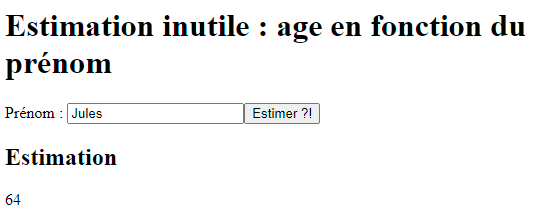
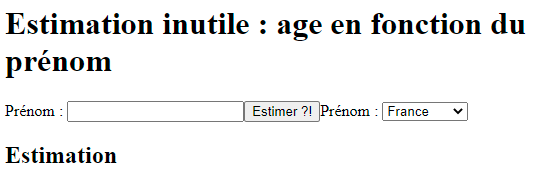
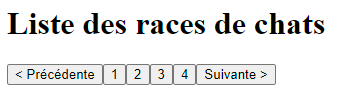
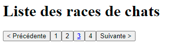

# Dojos React

## Dojo #1 : Utilisation d'API simple : Estimation inutile

A l'aide de l'API [Agify](https://agify.io/), estimez l'age d'une personne en donnant son prénom.

Ajoutez une liste déroulante avec l'option du pays pour affiner les recherches.

Vous devrez utiliser la méthode `fetch` pour récupérer les données.

## Dojo #2 : API chat 🐱

Réalisez une petite application permettant de lister toutes les races de chats grâce à l'API [Cat facts](https://catfact.ninja/).

L'API vous permet de récupérer les races de chats à l'url suivante : https://catfact.ninja/breeds. Elle vous renverra seulement les 25 premières entrées. Vous devrez donc réaliser un système de pagination pour afficher les différentes données.

- Etape 1 : Récupérer simplement la première page
- Etape 2 : Affichez les boutons *suivant* et *précédent* pour naviguer ainsi qu'un bouton pour chaque page disponible (4 avec cette API).
- Etape 3 : Ajouter du style pour repérer la page courante

Exemple de pagination

Exemple avec style

## Dojo #3 : Application d'animation de daily meeting

Réalisez une application où l'on peut :

- Définir une liste de participants (ajout / suppression)
- Lancer l'animation d'un daily meeting (et lancer un chronomètre) avec le premier participant
- Passer au participant suivant (sauvegarder le temps de parole du précédent, relancer le chronomètre pour le suivant)
- Garder en mémoire les temps de parole de chacun

Pour le premier tour de clavier, prenez le temps de commenter ce que vous souhaitez faire plutôt que de foncer tête baissée dans le code !
